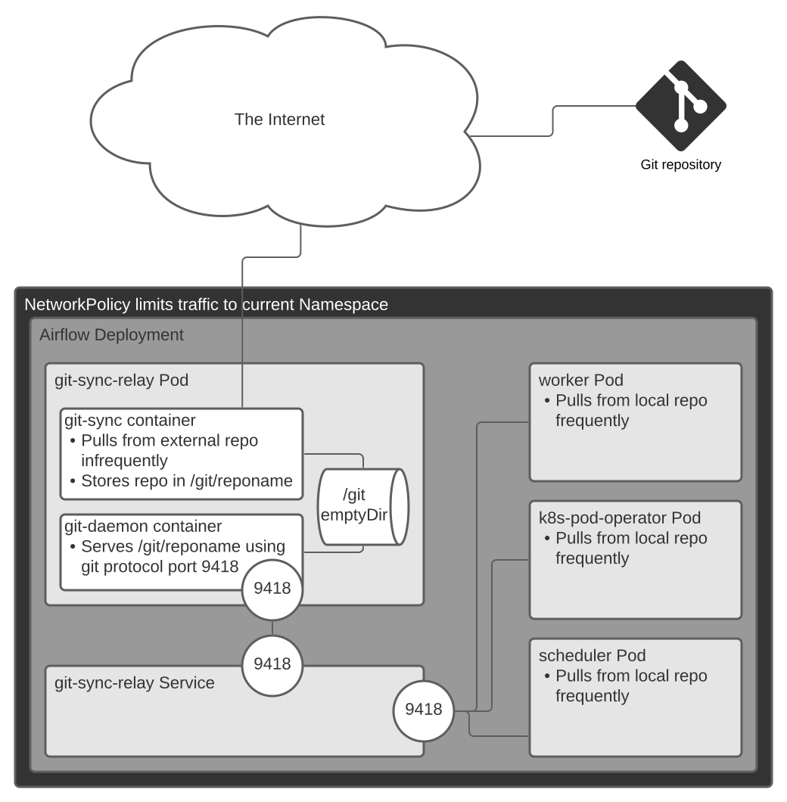

# Git Sync Relay

Git Sync Relay acts as a git repo relay between an upstream git server and the airflow deployment namespace. It uses the [kubernetes/git-sync](https://github.com/kubernetes/git-sync) sidecar to fetch a repo, and an additional container to expose this repo to the local namespace. This has been tested to work when logging into the git remote with authenticated git+ssh, and unauthenticated https.



## Configuration

In your helm values.yaml file, set values similar to these:

```yaml
gitSyncRelay:
  enabled: True

  repo:
    url: https://github.com/astronomer/airflow-example-dags
    branch: main
    depth: 1 # default to a shallow clone because it is faster, though it sacrifices git history
    wait: 60 # seconds between synchronizations with upstream git repo
    subPath: dags # if your dags dir is not the repo root, specify the path relative to the repo root
    sshPrivateKeySecretName: theGitSshPrivateKeyName # The name of a secret that holds the private key.
```

## Non-helm setup

When using this chart outside of Astronomer, for instance when testing or developing, if you are authenticating the git-sync-relay using ssh, you must manage a kubernetes secret that contains the ssh key. This is not managed by helm so that it is never stored in plaintext in the houston database. This is standard practice for any fields that can contain credentials, such as environment variables. This is also how it is implemented in the OSS helm chart <https://github.com/apache/airflow/blob/c8e6e5d52f999e9f/chart/values.yaml#L1493-L1511>

The process of creating the secret is pretty much:

```sh
ssh-keygen -P '' -t ed25519 -f ssh-sync-key-id -C "test key $USER"
kubectl create secret generic my-secret --from-file=gitSshKey=ssh-sync-key-id
```

Then take the `ssh-sync-key-id.pub` part and add it to your https://github.com/settings/keys or whatever server you're cloning from.
