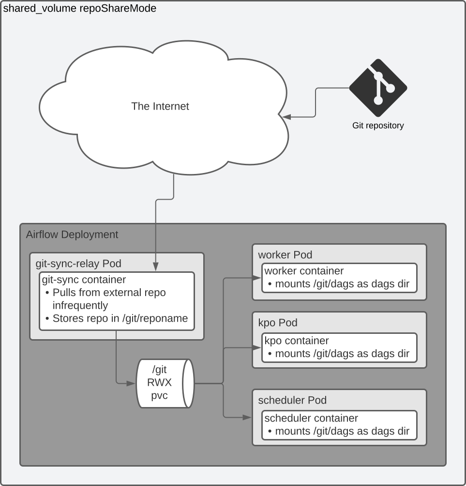

# Git Sync Relay

Git Sync Relay acts as a git repo relay between an upstream git server and the airflow deployment namespace. It uses the [kubernetes/git-sync](https://github.com/kubernetes/git-sync) sidecar to fetch a repo, and an additional container to expose this repo to the local namespace. This has been tested to work when logging into the git remote with authenticated git+ssh, and unauthenticated https. git-sync-relay can operate either through git_daemon repoSyncMode or shared_volume repoSyncMode


<br>


## Manual installation and management

When using this chart outside of Astronomer, for instance when testing or developing, if you are authenticating the git-sync-relay using ssh, you must manage a kubernetes secret that contains the ssh key. This is not managed by helm so that it is never stored in plaintext in the Astronomer houston database. Using k8s secrets for any fields that can contain credentials, such as environment variables, is standard practice in Astronomer components. This is also how it is implemented in the OSS helm chart <https://github.com/apache/airflow/blob/c8e6e5d52f999e9f/chart/values.yaml#L1493-L1511>

### Create an ssh key pair with no passphrase

First, create an ssh key that has no passphrase:

```sh
ssh-keygen -P '' -t ed25519 -f airflow-git-ssh -C "test key $USER@$HOSTNAME $(date +%FT%T%z)"
```

### Create a k8s secret from the private key

We create a k8s generic secret where the key is stored under `data.gitSshKey`, which is the required location for the private key:

```sh
kubectl create secret generic git-ssh-private-key --from-file=gitSshKey=airflow-git-ssh
```

### Add the pub key to your repo

Take the `airflow-git-ssh.pub` contents and add it to your https://github.com/settings/keys or whatever the equivalent is on the server you're cloning from.

### Install airflow-chart

Create a `values.yaml` file with contents similar to the following:

```yaml
gitSyncRelay:
  enabled: True
  repo:
    url: ssh+git://git@github.com/astronomer/2-4-example-dags.git # this can be https:// for public repositories
    branch: main
    depth: 1 # default to a shallow clone because it is faster, though it sacrifices git history
    wait: 60 # seconds between synchronizations with upstream git repo
    subPath: dags # if your dags dir is not the repo root, specify the path relative to the repo root
    sshPrivateKeySecretName: git-ssh-private-key # This is the secret we created earlier. This is not requred with https git remotes.

airflow:
  dags:
    gitSync:
      enabled: True
      repo: git://airflow-git-sync-relay.${NAMESPACE}.svc.cluster.local./git
      branch: main
```

### Install airflow

Once you have those values set up in your values.yaml file, you can install the astronomer airflow-chart using this repo as your source:

```sh
helm install airflow . -n aftest -f values.yaml  # where `.` is the root of this repository checked out to your filesystem
```
